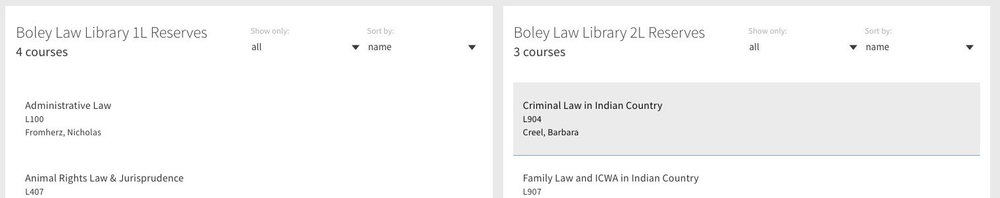
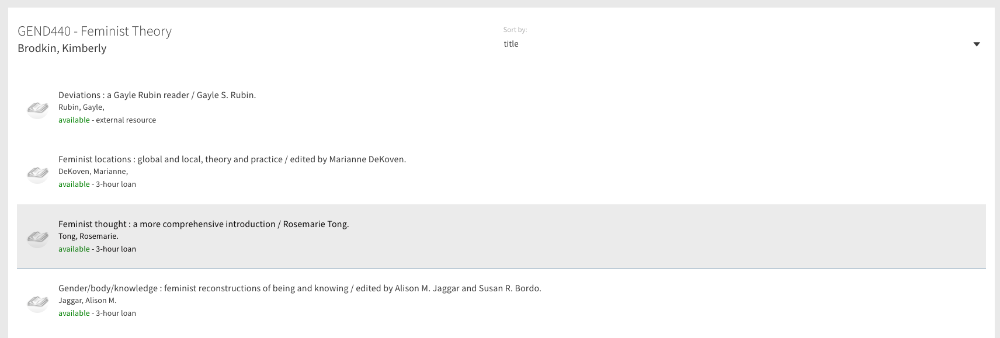

# primo-explore-course-reserves

<!--  -->

## Features
Two new routes are added to the primo-explore application at `/primo-explore/courses` and `/primo-explore/reserves`. The module can be configured with groups of course lists (e.g. for multiple library campuses) that pull currently active courses from Alma using a filter function. Links to a group of course lists can be realized by URLs of the form `/primo-explore/courses/:group` where `group` is an arbitrary identifier.

Course pages display a list of reserve materials with links to view the item in Primo and an indicator of the item's availability. Deep links to an individual course can be realized by URLs of the form `/primo-explore/reserves/:cid` where `cid` is the course id in Alma.

Both course lists and reserve lists are sortable. Course lists can be filtered by the course academic department code.

This package requires some prior configuration of server-side scripts to interact with the Alma API. Example PHP implementations are provided in the `php` folder.

### Screenshots



## Install
1. Make sure you've installed and configured [primo-explore-devenv](https://github.com/ExLibrisGroup/primo-explore-devenv).
2. Navigate to your template/central package root directory. For example:
    ```
    cd primo-explore/custom/MY_VIEW_ID
    ```
3. If you do not already have a `package.json` file in this directory, create one:
    ```
    npm init -y
    ```
4. Install this package:
    ```
    npm install primo-explore-course-reserves --save-dev
    ```
---

**IMPORTANT**

This package requires server-side scripts to interact with the Alma API and retrieve courses and bib records. Example PHP implementations can be found in the `php/` folder. These must be hosted in a location that allows cross-domain access via CORS so that they can be called from Primo.

---

## Usage
Once this package is installed, add `courseReserves` as a dependency for your custom module definition.

```js
var app = angular.module('viewCustom', ['courseReserves'])
```
Note: If you're using the `--browserify` build option, you will need to first import the module with:

```javascript
import 'primo-explore-course-reserves';
```

This module requires substantial configuration.

#### Course lists

The `courseLists` constant holds an array of course list objects. The "filter" property of the object will be passed to the server-side to query the Alma API, as [described here](https://developers.exlibrisgroup.com/alma/apis/courses/GET/gwPcGly021pX8N42Hi9+i8Te26R66L4t/25ede018-da5d-4780-8fda-a8e5d103faba).

#### URLs

The `URLs` constant holds an object whose properties are links to web services used to retrieve course and bibliographic information. The values of `course`, `courses`, and `bibs` should all point to server-side scripts similar to those in the `php` folder.

#### Loan Codes

The `loanCodes` constant is an object that maps values from Alma (fulfillment configuration > fulfillment units > fulfillment unit locations tab) to user-readable strings associated with an item's loan type. For example, a fulfillment unit with code `wrs24h` might stand for "24-hour reserves". This information is extracted from the `AVA` field of an item's MARC record.

### Example

The example below is for a library with view code MYLIB. It adds two course lists to the "law" group, and one to the "main" group. The lists would be accessible at `/primo-explore/courses/main?vid=MYLIB` and `/primo-explore/courses/law?vid=MYLIB`.

We assume that MYLIB has hosted PHP code similar to that provided in the `php/` folder on their server at `my.libary.edu` and enabled CORS.

```js

app.constant('courseLists', [
    {
      group: "main",
      title: "Main Campus Course Reserves",
      filter: "searchableid~main"
    },
    {
      group: "law",
      title: "Law Library 1L Reserves",
      filter: "searchableid~law1",
      sortType: "name"
    },
    {
      group: "law",
      title: "Law Library 2L Reserves",
      filter: "searchableid~law2",
      sortType: "name"
    }
])

app.constant('URLs', {
  courses: 'https://my.library.edu/getCourses.php?filter=',
  course: 'https://my.library.edu/getCourse.php?cid=',
  bibs: 'https://my.library.edu/getBib.php?mmsid=',
  covers: 'https://syndetics.com/index.aspx?isbn=',
  fallback: 'https://na01.alma.exlibrisgroup.com/view/delivery/thumbnail/01ALLIANCE_MYLIB/'
})

app.constant('loanCodes', {
  'loan3': '3-hour loan',
  'loan24': '24-hour loan',
  'loan72': '3-day loan',
  'law': 'law reserves'
})
```

<!-- ## Running tests
1. Clone the repo
2. Run `npm install`
3. Run `npm test` -->
